<div align="center">

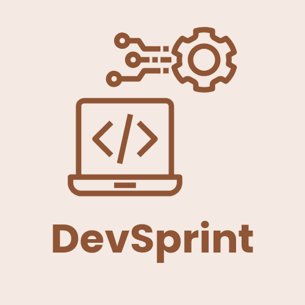
<br>

# DevSprint

**An AI-Driven Daily Coding Sprint Engine for the Relentless Developer**

[](https://flutter.dev/)
[](https://dart.dev/)
[](https://android.com/)
[](https://www.linux.org/)
[](https://windows.com/)
[](https://supabase.com/)
[](https://aistudio.google.com/)

DevSprint is a focused, AI-driven coding practice app for developers who want to turn deliberate practice into a repeatable daily habit. It generates a time-boxed engineering challenge, gives you a focused workspace to solve it, evaluates the submission with Gemini, records the result locally, and exposes progress through the app and optional Android home-screen widgets.

</div>

---

### Sneak Peek

- #### ONBOARDING

<p align="center">
  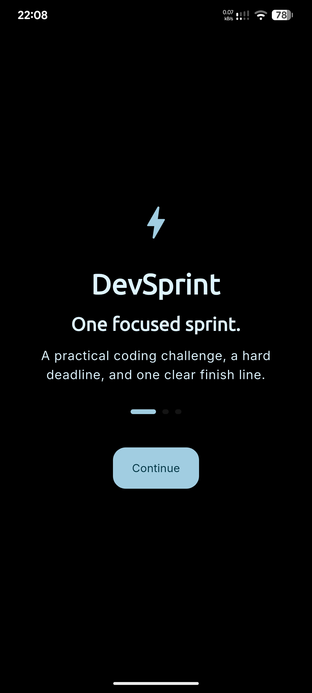
  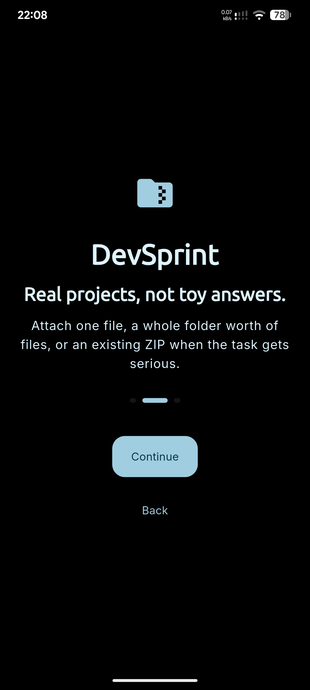
  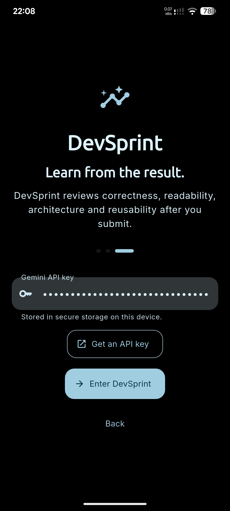
</p>

- #### HOME AND BACKGROUND EVALUATION QUEUE

<p align="center">
  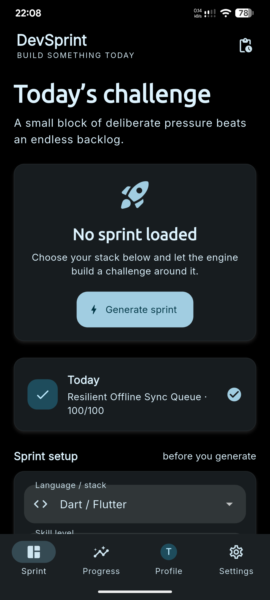
  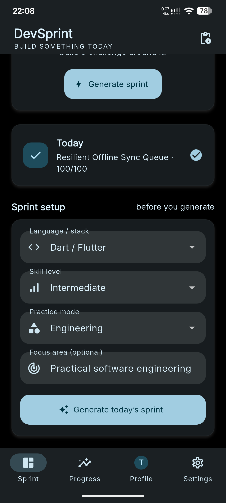
  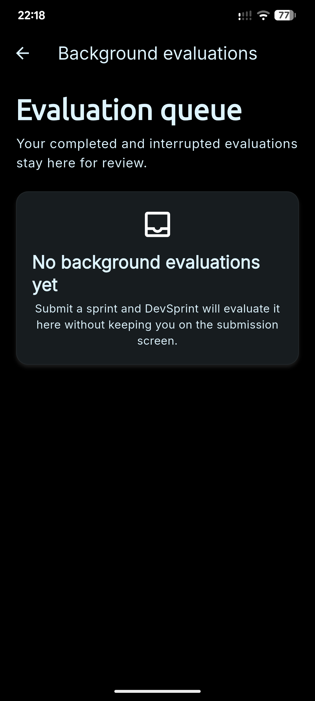
</p>

- #### PROFILE AND PROGRESS

<p align="center">
  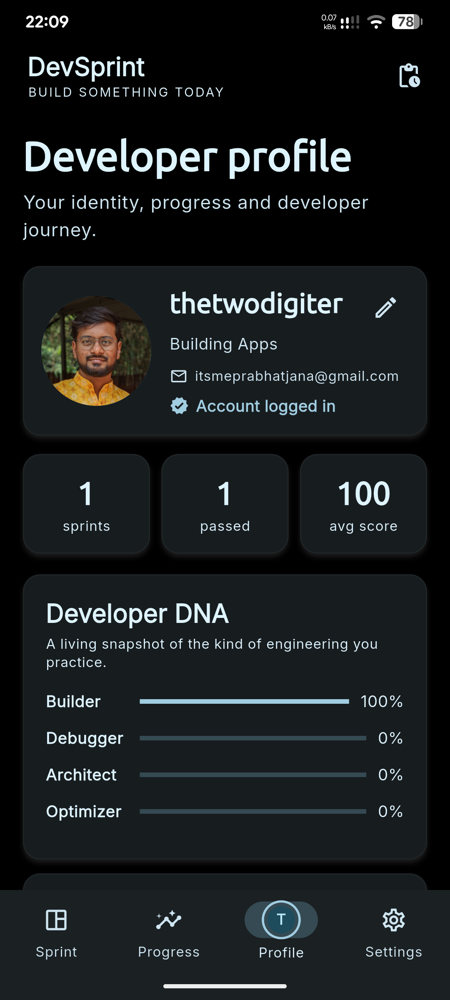
  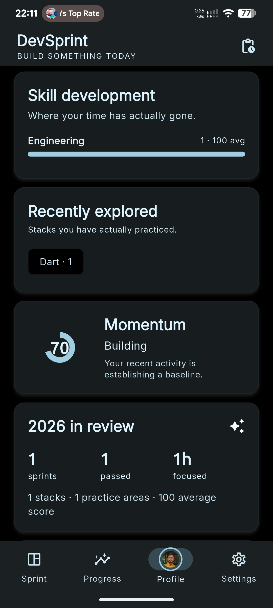
  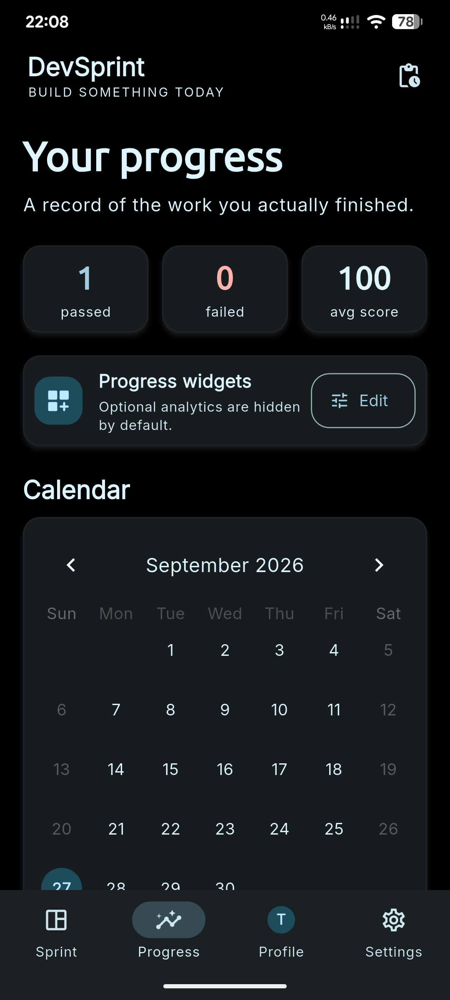
  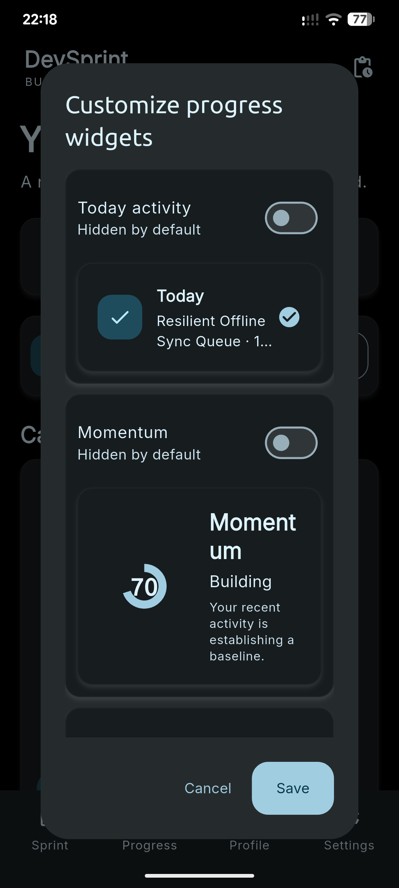
</p>

- #### SETTINGS

<p align="center">
  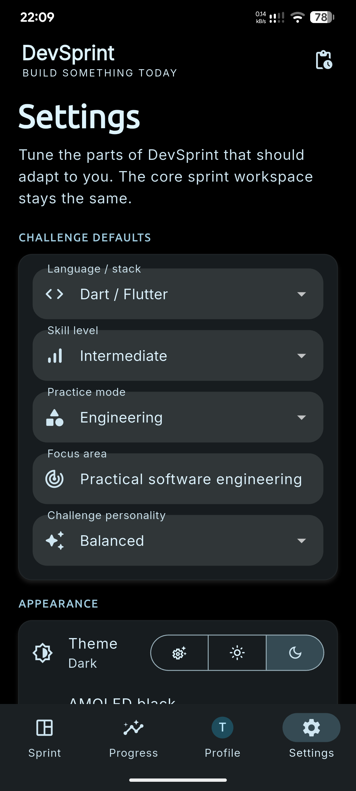
  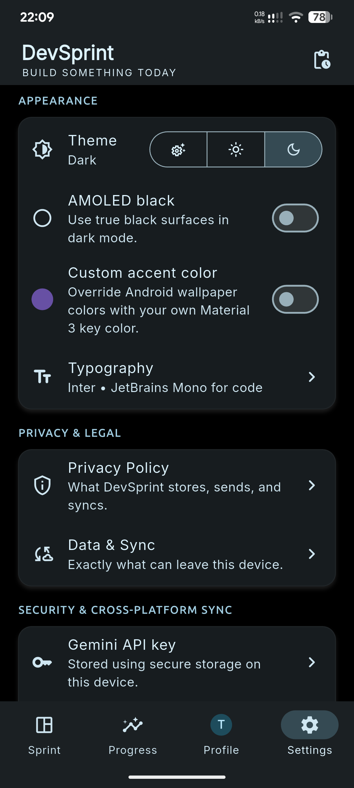
  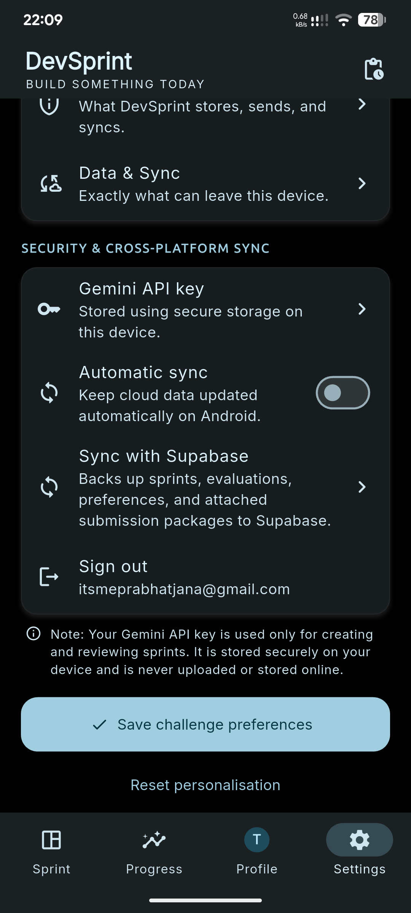
</p>

- #### SPRINT DETAILS

<p align="center">
  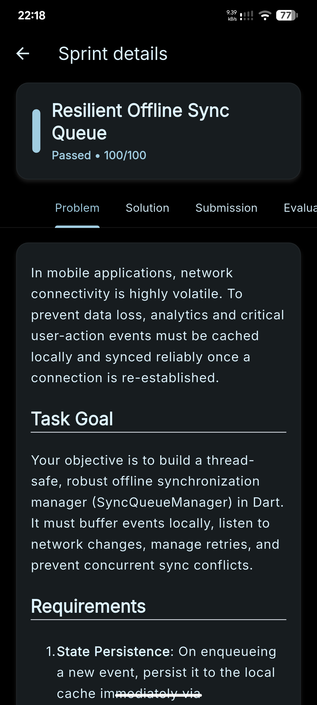
  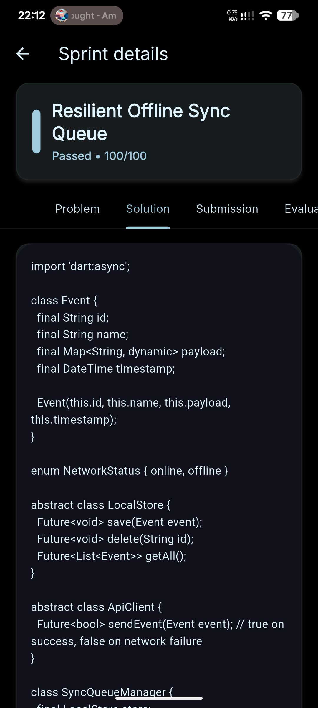
  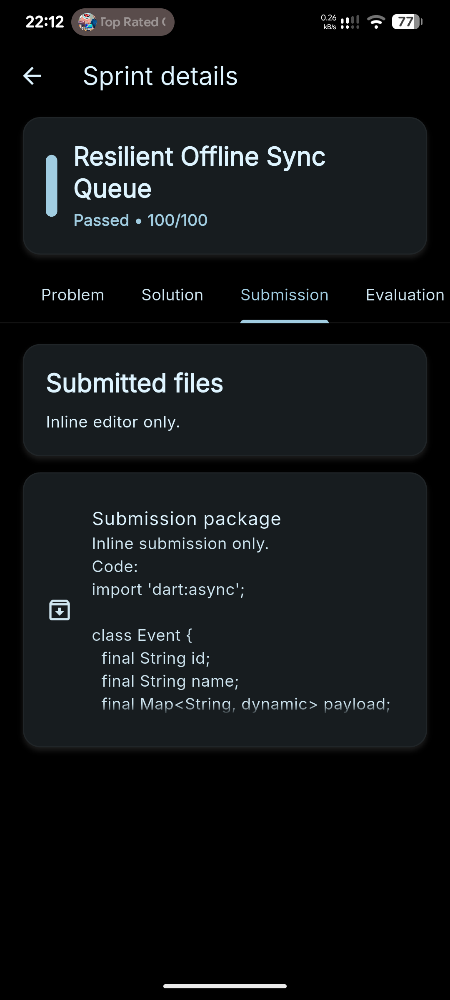
  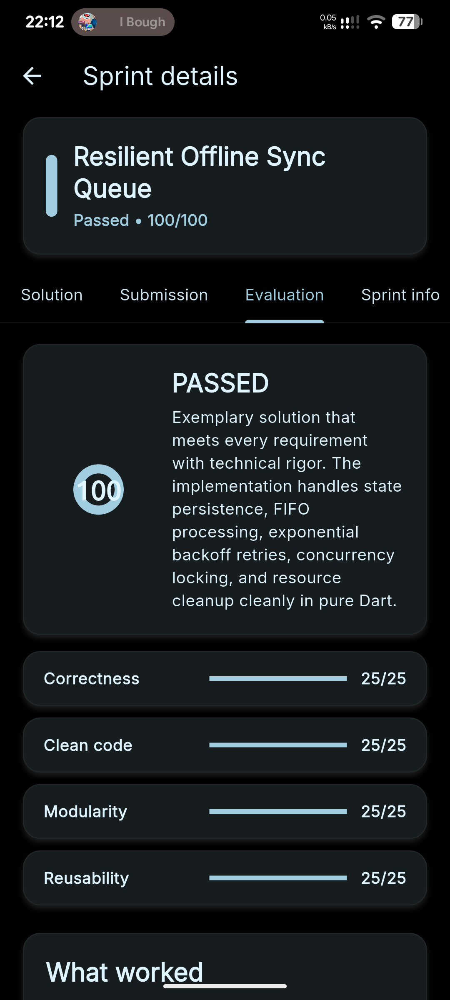
  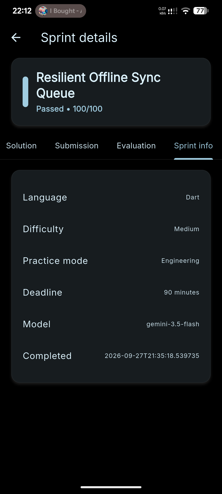
</p>

---

### Current release

**Version:** `1.1.0`

### Supported platforms
- Android
- Linux
- Windows

*iOS and macOS are not part of the current project.*

---

## What DevSprint does

### Daily coding sprints
A sprint is dynamically generated based on:
- Language / tech stack
- Skill level
- Practice mode
- Focus area
- Challenge personality
- Optional developer notes

The generator is instructed to prefer practical engineering work over generic competitive-programming algorithms. Supported practice areas include OOP and design, system design, APIs, databases, concurrency, debugging, testing, security, DevOps, UI engineering, mobile development, cloud/distributed systems, and code reading.

Generated tasks contain structured JSON including:
- Title & Language
- Difficulty & Deadline
- Summary & Problem Statement
- Constraints & Sample Cases
- Evaluation Focus & Practice Type

### Focus mode
Focus mode provides a distraction-free environment:
- Live countdown timer
- Optional source-file / ZIP attachments for full-project submissions
- Comprehensive AI evaluation

The submission is rigorously evaluated on four dimensions:
- Correctness
- Clean code
- Modularity
- Reusability

Each dimension is scored out of 25, yielding a final overall score out of 100.

### Local-first data
DevSprint stores your sprint history and session information entirely locally using **Hive**.
The Gemini API key is securely stored using `flutter_secure_storage`. The app functions perfectly well for local progress without a configured Supabase backend (though a Gemini key is always required for generating and evaluating tasks).

---

## Progress Tracking

The Progress page provides a core tracking experience:
1. Interactive Calendar
2. Recent Runs Log

Additional analytics are fully optional and hidden by default. Available widgets include:
- Today Activity & Momentum
- Monthly Activity & Activity Heatmap
- Weekly Rhythm & Skill Matrix
- Score Progression & Weak Spots
- Recently Explored & Year in Review

Use **Progress → Edit** to enable them. Your dashboard layout is persisted locally.

---

## Android Home-Screen Widgets

The Android build utilizes native `AppWidgetProvider` widgets (not just Flutter-only cards).
Available launcher widgets:
- **Activity**: Monthly activity calendar, 4×3 style with compact resizing
- **Today**: Today's completed sprints, focused time, and streak
- **Momentum**: Current streak and weekly activity
- **Rhythm**: Streak and weekly completion
- **Next Sprint**: Currently active generated sprint
- **Skill Activity**: Most-used practice areas
- **Quick Stats**: Completed, failed, average score, and focused time

Widget state flows smoothly from Flutter/Hive to Android via a `MethodChannel` and `SharedPreferences`. The Activity widget respects launcher resize callbacks, swapping between full and compact layouts seamlessly.

---

## Authentication and Sync

The current implementation leverages **Supabase Auth** for email/password authentication and **Supabase Postgres** for cross-device synchronization.

Sync securely backs up a snapshot containing:
- Profile name and bio
- Challenge preferences & Sprint history
- Evaluations & Submission metadata

**Privacy Detail:** A sprint record contains your submitted code and extracted source files. A manual Sync operation or Android Automatic Sync will upload that submission data to the configured Supabase backend. Your Gemini API key is never included in the sync snapshot.

### Automatic sync on Android
Android can keep DevSprint synchronized in the background. **Settings → Automatic sync** supports intervals from 1 to 12 hours utilizing Android WorkManager. Linux intentionally skips background synchronization (you will be prompted to sync on startup), while Windows handles sync manually via Settings.

---

## Gemini Configuration

Add your API credentials securely inside the app:
**Settings → Gemini API key**

They are encrypted and stored via `flutter_secure_storage`. For Gemini model selection logic, see `lib/services/gemini_service.dart`.

---

## Local Environment Setup

### Requirements
- Flutter stable
- Dart SDK (compatible with `pubspec.yaml`)
- Android Studio / Android SDK (for Android builds)
- Java 17
- GTK/Linux build dependencies
- Visual Studio C++ tooling

### Setup

```bash
git clone https://github.com/iamthetwodigiter/DevSprint.git
cd DevSprint
cp .env.example .env
flutter pub get --no-example
dart run build_runner build --delete-conflicting-outputs
```

Configure the Supabase values in `.env` if cross-device authentication/sync is desired. Add your Gemini API key through the app UI, not the `.env` file.

### Running the app

```bash
# Android
flutter run -d android

# Linux
flutter config --enable-linux-desktop
flutter run -d linux

# Windows
flutter config --enable-windows-desktop
flutter run -d windows
```

---

## CI / GitHub Actions

GitHub Actions is configured to automatically build:
- Android split APKs
- Linux x64
- Windows x64

The workflow provisions an empty `.env` in CI to ensure the application compiles cleanly without embedding sensitive environment credentials.

---

## Project Structure

```text
lib/
├── main.dart
├── models/
│   ├── task_model.dart
│   └── evaluation_model.dart
├── providers/
│   ├── task_notifier.dart
│   ├── evaluation_notifier.dart
│   ├── appearance_provider.dart
│   ├── theme_provider.dart
│   └── auth_provider.dart
├── services/
│   ├── gemini_service.dart
│   ├── hive_service.dart
│   ├── secure_storage_service.dart
│   ├── file_package_service.dart
│   ├── widget_bridge_service.dart
│   ├── auth_service.dart
│   ├── supabase_sync_service.dart
│   ├── user_preferences_service.dart
│   └── profile_image_service.dart
└── ui/
   ├── screens/
   └── widgets/
```

*Note: Riverpod generated files (`*.g.dart`) are checked into the repo so the project is immediately buildable upon cloning.*

---

## Submission Files and ZIP Packages

DevSprint supports two dynamic submission workflows:
1. **Multiple-file selection**: Attach several source files in one go.
2. **Existing ZIP selection**: Attach an existing project archive directly.

The app creates a finalized submission ZIP containing the selected files, storing it in the persistent application-support directory so it survives app restarts and participates in cloud synchronization.

For synced users, ZIP packages are uploaded to a private Supabase bucket named `devsprint-submissions`. The synchronized sprint JSON records the storage path, allowing other devices to seamlessly download the archive back into local storage.

---

## Contributing

We absolutely welcome contributions! If you'd like to help improve DevSprint, please follow these steps:

1. **Fork the repository** to your own GitHub account.
2. **Create a new branch** for your feature or bug fix (`git checkout -b feature/your-feature-name`).
3. **Make your changes** and ensure they adhere to the project's standards. Run `flutter analyze` to check for issues.
4. **Commit your changes** with clear, descriptive commit messages (`git commit -m "feat: add amazing new widget"`).
5. **Push to your branch** (`git push origin feature/your-feature-name`).
6. **Open a Pull Request** against the `main` branch, detailing your changes.

Please open an issue first to discuss significant UI/Architecture changes before submitting a massive pull request.

---

## Contributors

*   **[thetwodigiter](https://github.com/thetwodigiter)** - *Initial work & core development*

*(Future contributors will be added here)*

---

## License

This project is licensed under the GNU General Public License v3.0. 

See the [LICENSE](./LICENSE) file for complete details.